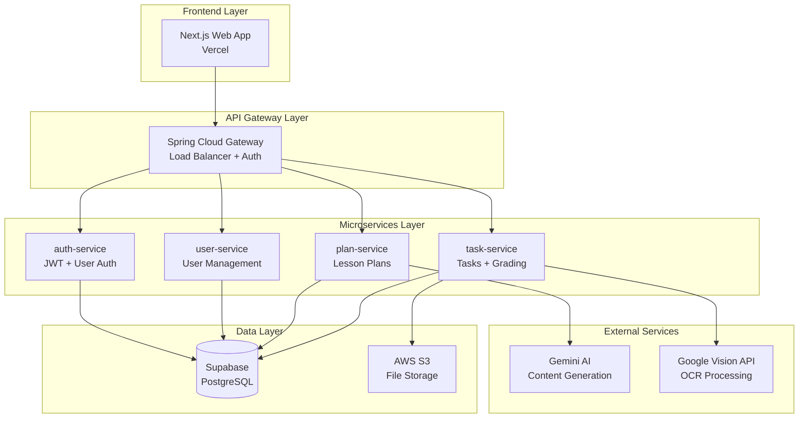
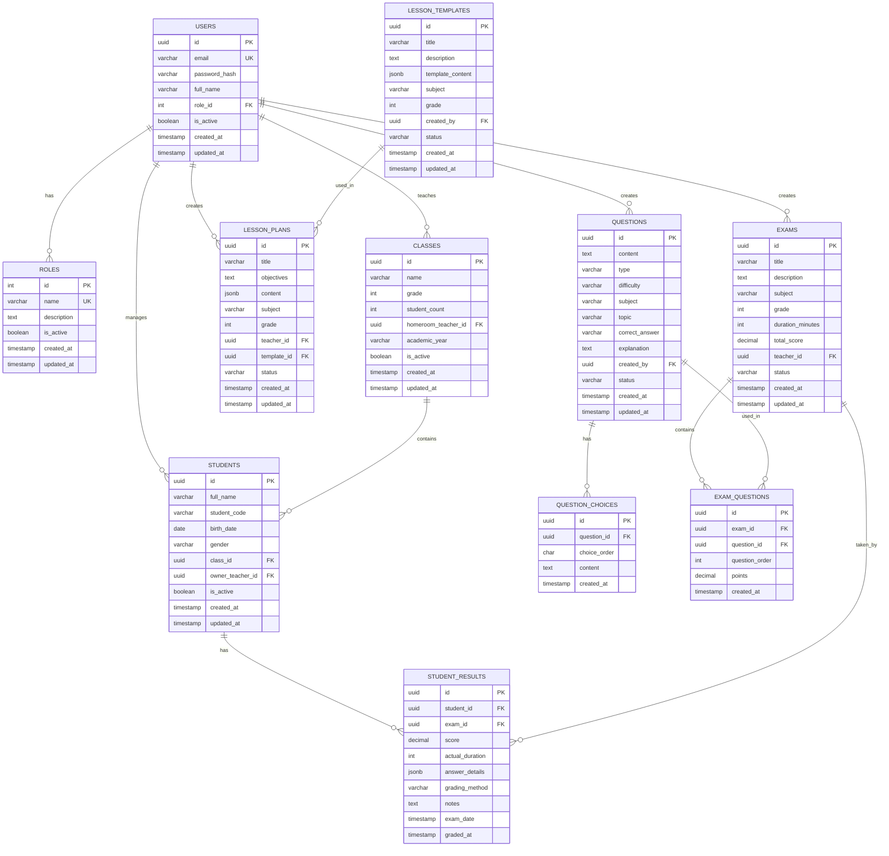

# Detailed Design

Chỉ nên tham khảo vì tài liệu có thể được thay đổi trong quá trình phát triển.

## 1. GIỚI THIỆU

### 1.1 Mục đích tài liệu

Tài liệu Thiết kế Chi tiết (DDD) này mô tả kiến trúc chi tiết, thiết kế cơ sở dữ liệu, thiết kế giao diện, và triển khai kỹ thuật cho hệ thống PlanbookAI. Tài liệu này được xây dựng dựa trên các yêu cầu đã được định nghĩa trong URD và SRS, cùng với kiến trúc tổng thể từ SAD.

### 1.2 Phạm vi tài liệu

Tài liệu bao gồm:

- Thiết kế kiến trúc microservices chi tiết
- Thiết kế cơ sở dữ liệu và data model
- Thiết kế API endpoints và data flow
- Thiết kế giao diện người dùng
- Thiết kế tích hợp AI và OCR
- Thiết kế bảo mật và authentication
- Triển khai deployment architecture

### 1.3 Tài liệu tham khảo

- URD-PlanbookAI.md - Tài liệu yêu cầu người dùng
- SRS.mdc - Đặc tả yêu cầu phần mềm  
- SAD.mdc - Tài liệu kiến trúc phần mềm
- overall.mdc - Tổng quan dự án

## 2. KIẾN TRÚC TỔNG THỂ

### 2.1 Mô hình Microservices



### 2.2 Luồng dữ liệu chính

1. **Authentication Flow**: Frontend → Gateway → auth-service → Database
2. **Content Creation**: Frontend → Gateway → plan-service → Gemini AI → Database
3. **OCR Grading**: Frontend → Gateway → task-service → Google Vision → S3 → Database
4. **User Management**: Frontend → Gateway → user-service → Database

## 3. THIẾT KẾ MICROSERVICES CHI TIẾT

### 3.1 auth-service

#### 3.1.1 Kiến trúc thành phần

```
auth-service/
├── src/main/java/com/planbookai/authservice/
│   ├── controller/
│   │   ├── XacThucController.java
│   │   └── QuenMatKhauController.java
│   ├── service/
│   │   ├── DichVuXacThuc.java
│   │   ├── DichVuJWT.java
│   │   └── DichVuEmail.java
│   ├── entity/
│   │   ├── NguoiDung.java
│   │   └── PhienDangNhap.java
│   ├── repository/
│   │   ├── KhoNguoiDung.java
│   │   └── KhoPhienDangNhap.java
│   ├── dto/
│   │   ├── YeuCauDangNhap.java
│   │   ├── PhanHoiDangNhap.java
│   │   └── ThongTinNguoiDung.java
│   └── config/
│       ├── CauHinhBaoMat.java
│       └── CauHinhJWT.java
```

#### 3.1.2 API Endpoints

```java
@RestController
@RequestMapping("/api/xac-thuc")
public class XacThucController {
    
    @PostMapping("/dang-nhap")
    public ResponseEntity<PhanHoiDangNhap> dangNhap(@RequestBody YeuCauDangNhap yeuCau) {
        // Logic xác thực người dùng
        // Tạo JWT token
        // Trả về thông tin người dùng và token
    }
    
    @PostMapping("/dang-xuat")
    public ResponseEntity<Void> dangXuat(@RequestHeader("Authorization") String token) {
        // Vô hiệu hóa JWT token
        // Xóa session nếu có
    }
    
    @PostMapping("/lam-moi-token")
    public ResponseEntity<PhanHoiDangNhap> lamMoiToken(@RequestBody String refreshToken) {
        // Kiểm tra refresh token
        // Tạo JWT token mới
    }
    
    @GetMapping("/kiem-tra-token")
    public ResponseEntity<ThongTinNguoiDung> kiemTraToken(@RequestHeader("Authorization") String token) {
        // Validate JWT token
        // Trả về thông tin người dùng
    }
}
```

#### 3.1.3 Entity Design

```java
@Entity
@Table(name = "users", schema = "users")
public class NguoiDung {
    @Id
    @GeneratedValue(strategy = GenerationType.IDENTITY)
    private Long id;
    
    @Column(unique = true, nullable = false)
    private String email;
    
    @Column(nullable = false)
    private String matKhauMaHoa;
    
    @Column(nullable = false)
    private String hoTen;
    
    @Enumerated(EnumType.STRING)
    private VaiTro vaiTro; // ADMIN, MANAGER, STAFF, TEACHER
    
    @Column(nullable = false)
    private Boolean trangThaiHoatDong = true;
    
    private LocalDateTime thoiGianTao;
    private LocalDateTime thoiGianCapNhat;
    
    // Getters, setters, constructors
}

public enum VaiTro {
    ADMIN("Quản trị viên"),
    MANAGER("Quản lý"),
    STAFF("Nhân viên"),
    TEACHER("Giáo viên");
    
    private final String tenHienThi;
    
    VaiTro(String tenHienThi) {
        this.tenHienThi = tenHienThi;
    }
}
```

### 3.2 user-service

#### 3.2.1 Kiến trúc thành phần

```
user-service/
├── src/main/java/com/planbookai/userservice/
│   ├── controller/
│   │   ├── QuanLyNguoiDungController.java
│   │   └── ThongTinCaNhanController.java
│   ├── service/
│   │   ├── DichVuNguoiDung.java
│   │   └── DichVuPhanQuyen.java
│   ├── entity/
│   │   ├── ThongTinNguoiDung.java
│   │   ├── LichSuHoatDong.java
│   │   └── CauHinhCaNhan.java
│   └── repository/
│       ├── KhoThongTinNguoiDung.java
│       └── KhoLichSuHoatDong.java
```

#### 3.2.2 API Endpoints

```java
@RestController
@RequestMapping("/api/nguoi-dung")
public class QuanLyNguoiDungController {
    
    @GetMapping
    @PreAuthorize("hasRole('ADMIN')")
    public ResponseEntity<Page<ThongTinNguoiDung>> layDanhSachNguoiDung(
            @RequestParam(defaultValue = "0") int trang,
            @RequestParam(defaultValue = "10") int kichThuoc,
            @RequestParam(required = false) String tuKhoa) {
        // Lấy danh sách người dùng với phân trang và tìm kiếm
    }
    
    @PostMapping
    @PreAuthorize("hasRole('ADMIN')")
    public ResponseEntity<ThongTinNguoiDung> taoNguoiDung(@RequestBody YeuCauTaoNguoiDung yeuCau) {
        // Tạo người dùng mới
        // Gửi email thông báo
    }
    
    @PutMapping("/{id}/trang-thai")
    @PreAuthorize("hasRole('ADMIN')")
    public ResponseEntity<Void> capNhatTrangThai(@PathVariable Long id, @RequestBody Boolean trangThai) {
        // Kích hoạt/vô hiệu hóa tài khoản
    }
    
    @GetMapping("/thong-tin-ca-nhan")
    public ResponseEntity<ThongTinNguoiDung> layThongTinCaNhan(Authentication auth) {
        // Lấy thông tin cá nhân của người dùng hiện tại
    }
}
```

### 3.3 plan-service

#### 3.3.1 Kiến trúc thành phần

```
plan-service/
├── src/main/java/com/planbookai/planservice/
│   ├── controller/
│   │   ├── GiaoAnController.java
│   │   ├── MauGiaoAnController.java
│   │   └── NganhangCauHoiController.java
│   ├── service/
│   │   ├── DichVuGiaoAn.java
│   │   ├── DichVuAI.java
│   │   └── DichVuNganHangCauHoi.java
│   ├── entity/
│   │   ├── GiaoAn.java
│   │   ├── MauGiaoAn.java
│   │   ├── CauHoi.java
│   │   └── ChuDe.java
│   ├── external/
│   │   └── GeminiAIClient.java
│   └── dto/
│       ├── YeuCauTaoGiaoAn.java
│       └── PhanHoiAI.java
```

#### 3.3.2 Entity Design - Giáo án

```java
@Entity
@Table(name = "lesson_plans", schema = "content")
public class GiaoAn {
    @Id
    @GeneratedValue(strategy = GenerationType.IDENTITY)
    private Long id;
    
    @Column(nullable = false)
    private String tieuDe;
    
    @Column(columnDefinition = "TEXT")
    private String mucTieu;
    
    @Column(columnDefinition = "TEXT")
    private String noiDung;
    
    @Column(columnDefinition = "TEXT")
    private String hoatDong;
    
    @Column(columnDefinition = "TEXT")
    private String danhGia;
    
    @ManyToOne
    @JoinColumn(name = "giao_vien_id")
    private NguoiDung giaoVien;
    
    @ManyToOne
    @JoinColumn(name = "template_id")
    private MauGiaoAn mauGiaoAn;
    
    @Column(nullable = false)
    private String monHoc;
    
    private String lop;
    private Integer thoiGianDay; // phút
    
    @Enumerated(EnumType.STRING)
    private TrangThaiGiaoAn trangThai;
    
    private LocalDateTime thoiGianTao;
    private LocalDateTime thoiGianCapNhat;
}

public enum TrangThaiGiaoAn {
    BAN_NHAP("Bản nháp"),
    HOAN_THANH("Hoàn thành"),
    DA_SU_DUNG("Đã sử dụng");
    
    private final String tenHienThi;
}
```

#### 3.3.3 Tích hợp Gemini AI

```java
@Service
public class DichVuAI {
    
    @Autowired
    private GeminiAIClient geminiClient;
    
    @Retryable(value = {Exception.class}, maxAttempts = 3)
    public String taoNoiDungGiaoAn(YeuCauTaoGiaoAn yeuCau) {
        String prompt = xayDungPromptGiaoAn(yeuCau);
        
        try {
            PhanHoiAI phanHoi = geminiClient.guiYeuCau(prompt);
            return xuLyPhanHoiAI(phanHoi);
        } catch (Exception e) {
            log.error("Lỗi khi gọi Gemini AI: {}", e.getMessage());
            throw new AIServiceException("Không thể tạo nội dung giáo án", e);
        }
    }
    
    private String xayDungPromptGiaoAn(YeuCauTaoGiaoAn yeuCau) {
        return String.format("""
            Tạo giáo án môn %s cho lớp %s với chủ đề: %s
            
            Yêu cầu:
            - Thời gian: %d phút
            - Mục tiêu: %s
            - Định dạng: Theo chương trình giáo dục Việt Nam
            - Ngôn ngữ: Tiếng Việt
            
            Cấu trúc mong muốn:
            1. Mục tiêu bài học
            2. Chuẩn bị
            3. Hoạt động dạy học
            4. Củng cố và đánh giá
            """,
            yeuCau.getMonHoc(),
            yeuCau.getLop(),
            yeuCau.getChuDe(),
            yeuCau.getThoiGianDay(),
            yeuCau.getMucTieu()
        );
    }
}
```

### 3.4 task-service

#### 3.4.1 Kiến trúc thành phần

```
task-service/
├── src/main/java/com/planbookai/taskservice/
│   ├── controller/
│   │   ├── DeThistController.java
│   │   ├── ChamDiemController.java
│   │   └── KetQuaController.java
│   ├── service/
│   │   ├── DichVuDeThi.java
│   │   ├── DichVuOCR.java
│   │   ├── DichVuChamDiem.java
│   │   └── DichVuPhanTich.java
│   ├── entity/
│   │   ├── DeThi.java
│   │   ├── BaiLam.java
│   │   ├── KetQua.java
│   │   └── HocSinh.java
│   ├── external/
│   │   └── GoogleVisionClient.java
│   └── dto/
│       ├── YeuCauTaoDeThi.java
│       ├── KetQuaOCR.java
│       └── ThongKeKetQua.java
```

#### 3.4.2 Entity Design - Đề thi và Kết quả

```java
@Entity
@Table(name = "exams", schema = "assessment")
public class DeThi {
    @Id
    @GeneratedValue(strategy = GenerationType.IDENTITY)
    private Long id;
    
    @Column(nullable = false)
    private String tieuDe;
    
    @Column(nullable = false)
    private String monHoc;
    
    private String lop;
    private Integer thoiGianLam; // phút
    private Integer tongDiem;
    
    @OneToMany(mappedBy = "deThi", cascade = CascadeType.ALL)
    private List<CauHoiTrongDeThi> danhSachCauHoi;
    
    @ManyToOne
    @JoinColumn(name = "giao_vien_id")
    private NguoiDung giaoVien;
    
    @Column(columnDefinition = "TEXT")
    private String huongDanLamBai;
    
    @Enumerated(EnumType.STRING)
    private TrangThaiDeThi trangThai;
    
    private LocalDateTime thoiGianTao;
}

@Entity
@Table(name = "students", schema = "students")
public class HocSinh {
    @Id
    @GeneratedValue(strategy = GenerationType.IDENTITY)
    private Long id;
    
    @Column(nullable = false)
    private String hoTen;
    
    private String maSoHocSinh;
    private String lop;
    
    @ManyToOne
    @JoinColumn(name = "giao_vien_id")
    private NguoiDung giaoVien; // Giáo viên quản lý
    
    @OneToMany(mappedBy = "hocSinh")
    private List<KetQua> danhSachKetQua;
    
    // Metadata để theo dõi hiệu suất
    private Double diemTrungBinh;
    private Integer soLanThi;
    
    private LocalDateTime thoiGianTao;
}

@Entity
@Table(name = "student_results", schema = "students")
public class KetQua {
    @Id
    @GeneratedValue(strategy = GenerationType.IDENTITY)
    private Long id;
    
    @ManyToOne
    @JoinColumn(name = "student_id")
    private HocSinh hocSinh;
    
    @ManyToOne
    @JoinColumn(name = "exam_id")
    private DeThi deThi;
    
    private Double diem;
    private Integer soCauDung;
    private Integer tongSoCau;
    
    @Column(columnDefinition = "TEXT")
    private String chiTietDapAn; // JSON format
    
    @Column(columnDefinition = "TEXT")
    private String duongDanBaiLam; // S3 URL
    
    @Enumerated(EnumType.STRING)
    private TrangThaiChamDiem trangThaiCham;
    
    private LocalDateTime thoiGianNop;
    private LocalDateTime thoiGianCham;
}
```

#### 3.4.3 OCR Service Implementation

```java
@Service
public class DichVuOCR {
    
    @Autowired
    private GoogleVisionClient visionClient;
    
    @Autowired
    private AmazonS3 s3Client;
    
    public KetQuaOCR xuLyBaiLam(MultipartFile anhBaiLam, Long deThiId) {
        try {
            // 1. Upload ảnh lên S3
            String duongDanS3 = luuAnhLenS3(anhBaiLam);
            
            // 2. Xử lý OCR
            KetQuaOCR ketQuaOCR = thucHienOCR(anhBaiLam.getBytes());
            
            // 3. Trích xuất thông tin học sinh
            ThongTinHocSinh thongTinHS = trichXuatThongTinHocSinh(ketQuaOCR);
            
            // 4. Trích xuất đáp án
            List<String> dapAn = trichXuatDapAn(ketQuaOCR, deThiId);
            
            // 5. Tính điểm
            KetQuaChamDiem ketQua = tinhDiem(dapAn, deThiId);
            
            // 6. Lưu kết quả
            luuKetQua(thongTinHS, ketQua, duongDanS3, deThiId);
            
            return ketQuaOCR;
            
        } catch (Exception e) {
            log.error("Lỗi xử lý OCR: {}", e.getMessage());
            throw new OCRProcessingException("Không thể xử lý bài làm", e);
        }
    }
    
    private KetQuaOCR thucHienOCR(byte[] anhData) {
        // Gọi Google Vision API
        DetectTextRequest request = DetectTextRequest.newBuilder()
            .setImage(Image.newBuilder().setContent(ByteString.copyFrom(anhData)))
            .build();
            
        BatchAnnotateImagesResponse response = visionClient.batchAnnotateImages(request);
        
        return xuLyPhanHoiOCR(response);
    }
    
    private ThongTinHocSinh trichXuatThongTinHocSinh(KetQuaOCR ketQuaOCR) {
        // Sử dụng regex để tìm tên và MSSV
        String text = ketQuaOCR.getVanBanNhanDang();
        
        Pattern tenPattern = Pattern.compile("Họ tên:?\\s*([\\p{L}\\s]+)");
        Pattern mssvPattern = Pattern.compile("MSSV:?\\s*(\\d+)");
        
        Matcher tenMatcher = tenPattern.matcher(text);
        Matcher mssvMatcher = mssvPattern.matcher(text);
        
        String hoTen = tenMatcher.find() ? tenMatcher.group(1).trim() : null;
        String mssv = mssvMatcher.find() ? mssvMatcher.group(1).trim() : null;
        
        return new ThongTinHocSinh(hoTen, mssv);
    }
    
    private List<String> trichXuatDapAn(KetQuaOCR ketQuaOCR, Long deThiId) {
        // Logic phức tạp để nhận dạng các lựa chọn A, B, C, D
        // Sử dụng tọa độ và pattern matching
        List<String> dapAn = new ArrayList<>();
        
        // Giả định format: câu hỏi 1-50, mỗi câu có 4 lựa chọn
        for (int i = 1; i <= 50; i++) {
            String luaChon = nhanDangLuaChonCauHoi(ketQuaOCR, i);
            dapAn.add(luaChon);
        }
        
        return dapAn;
    }
}
```

## 4. THIẾT KẾ CƠ SỞ DỮ LIỆU

### 4.1 Sơ đồ ERD tổng quan



### 4.2 Thiết kế Index và Performance

```sql
-- Indexes cho hiệu suất truy vấn (Schema: users, content, assessment, students)

-- User Management indexes
CREATE INDEX idx_users_email ON users.users(email);
CREATE INDEX idx_users_role ON users.users(role_id);
CREATE INDEX idx_sessions_user ON users.sessions(user_id);
CREATE INDEX idx_sessions_token ON users.sessions(token);

-- Educational Content indexes
CREATE INDEX idx_lesson_plans_teacher ON content.lesson_plans(teacher_id);
CREATE INDEX idx_lesson_plans_subject ON content.lesson_plans(subject);
CREATE INDEX idx_lesson_plans_status ON content.lesson_plans(status);
CREATE INDEX idx_lesson_templates_subject ON content.lesson_templates(subject);

-- Assessment indexes
CREATE INDEX idx_questions_subject ON assessment.questions(subject);
CREATE INDEX idx_questions_topic ON assessment.questions(topic);
CREATE INDEX idx_questions_difficulty ON assessment.questions(difficulty);
CREATE INDEX idx_questions_created_by ON assessment.questions(created_by);
CREATE INDEX idx_exams_teacher ON assessment.exams(teacher_id);
CREATE INDEX idx_exams_subject ON assessment.exams(subject);
CREATE INDEX idx_question_choices_question ON assessment.question_choices(question_id);

-- Student Data indexes
CREATE INDEX idx_students_class ON students.students(class_id);
CREATE INDEX idx_students_teacher ON students.students(owner_teacher_id);
CREATE INDEX idx_students_code ON students.students(student_code);
CREATE INDEX idx_student_results_student ON students.student_results(student_id);
CREATE INDEX idx_student_results_exam ON students.student_results(exam_id);
CREATE INDEX idx_student_results_exam_date ON students.student_results(exam_date);
```

## 5. THIẾT KẾ API CHI TIẾT

### 5.1 API Gateway Configuration

```yaml
# application.yml cho gateway-service
spring:
  cloud:
    gateway:
      routes:
        - id: auth-service
          uri: http://auth-service:8081
          predicates:
            - Path=/api/xac-thuc/**
          filters:
            - StripPrefix=0
            
        - id: user-service
          uri: http://user-service:8082
          predicates:
            - Path=/api/nguoi-dung/**
          filters:
            - StripPrefix=0
            - name: AuthenticationFilter
              
        - id: plan-service
          uri: http://plan-service:8083
          predicates:
            - Path=/api/giao-an/**, /api/cau-hoi/**
          filters:
            - StripPrefix=0
            - name: AuthenticationFilter
            
        - id: task-service
          uri: http://task-service:8084
          predicates:
            - Path=/api/de-thi/**, /api/cham-diem/**
          filters:
            - StripPrefix=0
            - name: AuthenticationFilter
```

### 5.2 RESTful API Endpoints

#### 5.2.1 Authentication APIs

```
POST   /api/xac-thuc/dang-nhap           # Đăng nhập
POST   /api/xac-thuc/dang-xuat           # Đăng xuất
POST   /api/xac-thuc/lam-moi-token       # Làm mới JWT token
GET    /api/xac-thuc/kiem-tra-token      # Kiểm tra tính hợp lệ token
POST   /api/xac-thuc/quen-mat-khau       # Quên mật khẩu
POST   /api/xac-thuc/dat-lai-mat-khau    # Đặt lại mật khẩu
```

#### 5.2.2 User Management APIs

```
GET    /api/nguoi-dung                   # Lấy danh sách người dùng (Admin)
POST   /api/nguoi-dung                   # Tạo người dùng mới (Admin)
GET    /api/nguoi-dung/{id}              # Lấy thông tin người dùng
PUT    /api/nguoi-dung/{id}              # Cập nhật thông tin người dùng
DELETE /api/nguoi-dung/{id}              # Xóa người dùng (Admin)
PUT    /api/nguoi-dung/{id}/trang-thai   # Kích hoạt/vô hiệu hóa (Admin)
GET    /api/nguoi-dung/thong-tin-ca-nhan # Thông tin cá nhân
PUT    /api/nguoi-dung/thong-tin-ca-nhan # Cập nhật thông tin cá nhân
```

#### 5.2.3 Lesson Plan APIs

```
GET    /api/giao-an                      # Lấy danh sách giáo án
POST   /api/giao-an                      # Tạo giáo án mới
GET    /api/giao-an/{id}                 # Lấy chi tiết giáo án
PUT    /api/giao-an/{id}                 # Cập nhật giáo án
DELETE /api/giao-an/{id}                 # Xóa giáo án
POST   /api/giao-an/tao-tu-ai            # Tạo giáo án bằng AI
GET    /api/giao-an/mau                  # Lấy danh sách mẫu giáo án
POST   /api/giao-an/mau                  # Tạo mẫu giáo án (Staff)
```

#### 5.2.4 Question Bank APIs

```
GET    /api/cau-hoi                      # Lấy danh sách câu hỏi
POST   /api/cau-hoi                      # Tạo câu hỏi mới
GET    /api/cau-hoi/{id}                 # Lấy chi tiết câu hỏi
PUT    /api/cau-hoi/{id}                 # Cập nhật câu hỏi
DELETE /api/cau-hoi/{id}                 # Xóa câu hỏi
POST   /api/cau-hoi/nhap-excel           # Nhập câu hỏi từ Excel
GET    /api/cau-hoi/tim-kiem             # Tìm kiếm câu hỏi
GET    /api/cau-hoi/chu-de               # Lấy danh sách chủ đề
```

#### 5.2.5 Exam Management APIs

```
GET    /api/de-thi                       # Lấy danh sách đề thi
POST   /api/de-thi                       # Tạo đề thi mới
GET    /api/de-thi/{id}                  # Lấy chi tiết đề thi
PUT    /api/de-thi/{id}                  # Cập nhật đề thi
DELETE /api/de-thi/{id}                  # Xóa đề thi
POST   /api/de-thi/tao-tu-dong           # Tạo đề thi tự động
GET    /api/de-thi/{id}/xuat-pdf         # Xuất đề thi ra PDF
```

#### 5.2.6 Grading APIs

```
POST   /api/cham-diem/ocr                # Chấm điểm bằng OCR
GET    /api/cham-diem/ket-qua/{id}       # Lấy kết quả chấm điểm
PUT    /api/cham-diem/sua-ket-qua/{id}   # Sửa kết quả chấm điểm
GET    /api/cham-diem/thong-ke           # Thống kê kết quả
POST   /api/cham-diem/xuat-excel         # Xuất kết quả ra Excel
```

### 5.3 Data Transfer Objects (DTOs)

```java
// Authentication DTOs
public class YeuCauDangNhap {
    @NotBlank(message = "Email không được để trống")
    @Email(message = "Email không đúng định dạng")
    private String email;
    
    @NotBlank(message = "Mật khẩu không được để trống")
    @Size(min = 8, message = "Mật khẩu phải có ít nhất 8 ký tự")
    private String matKhau;
}

public class PhanHoiDangNhap {
    private String accessToken;
    private String refreshToken;
    private String tokenType = "Bearer";
    private Long expiresIn;
    private ThongTinNguoiDungDTO thongTinNguoiDung;
}

// Lesson Plan DTOs
public class YeuCauTaoGiaoAn {
    @NotBlank(message = "Tiêu đề không được để trống")
    private String tieuDe;
    
    @NotBlank(message = "Môn học không được để trống")
    private String monHoc;
    
    private String lop;
    private String chuDe;
    private String mucTieu;
    private Integer thoiGianDay;
    private Long mauGiaoAnId;
}

// OCR Processing DTOs
public class YeuCauChamDiemOCR {
    @NotNull(message = "File ảnh không được để trống")
    private MultipartFile anhBaiLam;
    
    @NotNull(message = "ID đề thi không được để trống")
    private Long deThiId;
    
    private String ghiChu;
}

public class KetQuaChamDiemDTO {
    private Long id;
    private String tenHocSinh;
    private String maSoHocSinh;
    private Double diem;
    private Integer soCauDung;
    private Integer tongSoCau;
    private List<ChiTietDapAnDTO> chiTietDapAn;
    private String duongDanBaiLam;
    private LocalDateTime thoiGianCham;
}
```

## 6. THIẾT KẾ GIAO DIỆN NGƯỜI DÙNG

### 6.1 Kiến trúc Frontend

```
frontend/
├── src/
│   ├── components/
│   │   ├── layout/
│   │   │   ├── Header.tsx
│   │   │   ├── Sidebar.tsx
│   │   │   └── Footer.tsx
│   │   ├── auth/
│   │   │   ├── DangNhapForm.tsx
│   │   │   └── QuenMatKhauForm.tsx
│   │   ├── giao-an/
│   │   │   ├── DanhSachGiaoAn.tsx
│   │   │   ├── TaoGiaoAn.tsx
│   │   │   └── ChiTietGiaoAn.tsx
│   │   ├── de-thi/
│   │   │   ├── DanhSachDeThi.tsx
│   │   │   ├── TaoDeThi.tsx
│   │   │   └── XemDeThi.tsx
│   │   └── cham-diem/
│   │       ├── UploadBaiLam.tsx
│   │       ├── KetQuaChamDiem.tsx
│   │       └── ThongKeKetQua.tsx
│   ├── pages/
│   │   ├── dang-nhap.tsx
│   │   ├── dashboard.tsx
│   │   ├── giao-an/
│   │   ├── de-thi/
│   │   └── cham-diem/
│   ├── hooks/
│   │   ├── useAuth.ts
│   │   ├── useAPI.ts
│   │   └── useOCR.ts
│   ├── services/
│   │   ├── authService.ts
│   │   ├── giaoAnService.ts
│   │   ├── deThiService.ts
│   │   └── chamDiemService.ts
│   ├── types/
│   │   ├── auth.types.ts
│   │   ├── giaoAn.types.ts
│   │   └── deThi.types.ts
│   └── utils/
│       ├── api.ts
│       ├── constants.ts
│       └── helpers.ts
```

### 6.2 Responsive Design

```tsx
// Layout chính với responsive design
const Layout: React.FC<{ children: React.ReactNode }> = ({ children }) => {
  const [sidebarOpen, setSidebarOpen] = useState(false);
  
  return (
    <div className="min-h-screen bg-gray-50">
      {/* Header */}
      <header className="bg-white shadow-sm border-b border-gray-200">
        <div className="max-w-7xl mx-auto px-4 sm:px-6 lg:px-8">
          <div className="flex justify-between h-16">
            <div className="flex items-center">
              <button
                className="md:hidden p-2 rounded-md text-gray-400 hover:text-gray-500"
                onClick={() => setSidebarOpen(!sidebarOpen)}
              >
                <MenuIcon className="h-6 w-6" />
              </button>
              <h1 className="text-xl font-semibold text-gray-900 ml-2">
                PlanbookAI
              </h1>
            </div>
            <UserMenu />
          </div>
        </div>
      </header>

      <div className="flex">
        {/* Sidebar */}
        <aside className={`
          ${sidebarOpen ? 'translate-x-0' : '-translate-x-full'}
          md:translate-x-0 transition-transform duration-300 ease-in-out
          fixed md:static inset-y-0 left-0 z-50
          w-64 bg-white shadow-lg border-r border-gray-200
        `}>
          <Navigation />
        </aside>

        {/* Main content */}
        <main className="flex-1 p-6">
          {children}
        </main>
      </div>
    </div>
  );
};
```

### 6.3 Component thiết kế - Tạo giáo án

```tsx
const TaoGiaoAn: React.FC = () => {
  const [form] = Form.useForm();
  const [loading, setLoading] = useState(false);
  const { taoGiaoAnBangAI } = useGiaoAn();

  const handleSubmit = async (values: YeuCauTaoGiaoAn) => {
    setLoading(true);
    try {
      const giaoAn = await taoGiaoAnBangAI(values);
      message.success('Tạo giáo án thành công!');
      // Redirect to detail page
    } catch (error) {
      message.error('Có lỗi xảy ra khi tạo giáo án');
    } finally {
      setLoading(false);
    }
  };

  return (
    <div className="max-w-4xl mx-auto">
      <div className="bg-white rounded-lg shadow p-6">
        <h2 className="text-2xl font-bold text-gray-900 mb-6">
          Tạo Giáo Án Mới
        </h2>
        
        <Form
          form={form}
          layout="vertical"
          onFinish={handleSubmit}
          className="space-y-4"
        >
          <Row gutter={16}>
            <Col span={12}>
              <Form.Item
                name="tieuDe"
                label="Tiêu đề bài học"
                rules={[{ required: true, message: 'Vui lòng nhập tiêu đề' }]}
              >
                <Input placeholder="VD: Phản ứng oxi hóa khử" />
              </Form.Item>
            </Col>
            <Col span={12}>
              <Form.Item
                name="monHoc"
                label="Môn học"
                rules={[{ required: true, message: 'Vui lòng chọn môn học' }]}
              >
                <Select placeholder="Chọn môn học">
                  <Option value="Hóa học">Hóa học</Option>
                  <Option value="Vật lý">Vật lý</Option>
                  <Option value="Sinh học">Sinh học</Option>
                </Select>
              </Form.Item>
            </Col>
          </Row>

          <Row gutter={16}>
            <Col span={12}>
              <Form.Item name="lop" label="Lớp">
                <Select placeholder="Chọn lớp">
                  <Option value="10">Lớp 10</Option>
                  <Option value="11">Lớp 11</Option>
                  <Option value="12">Lớp 12</Option>
                </Select>
              </Form.Item>
            </Col>
            <Col span={12}>
              <Form.Item name="thoiGianDay" label="Thời gian dạy (phút)">
                <InputNumber
                  min={15}
                  max={180}
                  placeholder="45"
                  className="w-full"
                />
              </Form.Item>
            </Col>
          </Row>

          <Form.Item name="mucTieu" label="Mục tiêu bài học">
            <TextArea
              rows={4}
              placeholder="Mô tả mục tiêu kiến thức, kỹ năng và thái độ..."
            />
          </Form.Item>

          <Form.Item name="chuDe" label="Chủ đề chi tiết">
            <TextArea
              rows={3}
              placeholder="Mô tả chi tiết nội dung và yêu cầu..."
            />
          </Form.Item>

          <div className="flex justify-end space-x-4">
            <Button onClick={() => form.resetFields()}>
              Hủy bỏ
            </Button>
            <Button
              type="primary"
              htmlType="submit"
              loading={loading}
              icon={<RobotOutlined />}
            >
              Tạo bằng AI
            </Button>
          </div>
        </Form>
      </div>
    </div>
  );
};
```

### 6.4 Component chấm điểm OCR

```tsx
const ChamDiemOCR: React.FC = () => {
  const [files, setFiles] = useState<File[]>([]);
  const [processing, setProcessing] = useState(false);
  const [results, setResults] = useState<KetQuaChamDiemDTO[]>([]);
  const { chamDiemBangOCR } = useChamDiem();

  const handleUpload = async () => {
    if (files.length === 0) {
      message.warning('Vui lòng chọn ít nhất một file ảnh');
      return;
    }

    setProcessing(true);
    try {
      const promises = files.map(file => 
        chamDiemBangOCR({
          anhBaiLam: file,
          deThiId: selectedExamId
        })
      );
      
      const ketQua = await Promise.all(promises);
      setResults(ketQua);
      message.success(`Đã chấm xong ${ketQua.length} bài`);
    } catch (error) {
      message.error('Có lỗi xảy ra trong quá trình chấm điểm');
    } finally {
      setProcessing(false);
    }
  };

  const uploadProps: UploadProps = {
    multiple: true,
    accept: 'image/*',
    beforeUpload: (file) => {
      setFiles(prev => [...prev, file]);
      return false; // Prevent auto upload
    },
    onRemove: (file) => {
      setFiles(prev => prev.filter(f => f !== file));
    }
  };

  return (
    <div className="max-w-6xl mx-auto">
      <div className="bg-white rounded-lg shadow p-6">
        <h2 className="text-2xl font-bold text-gray-900 mb-6">
          Chấm Điểm Bằng OCR
        </h2>

        {/* Upload Area */}
        <div className="mb-6">
          <Dragger {...uploadProps} className="mb-4">
            <p className="ant-upload-drag-icon">
              <InboxOutlined />
            </p>
            <p className="ant-upload-text">
              Kéo thả ảnh bài làm vào đây hoặc click để chọn
            </p>
            <p className="ant-upload-hint">
              Hỗ trợ định dạng JPG, PNG, PDF. Có thể upload nhiều file cùng lúc.
            </p>
          </Dragger>

          <div className="flex justify-between items-center">
            <span className="text-sm text-gray-500">
              Đã chọn {files.length} file
            </span>
            <Button
              type="primary"
              onClick={handleUpload}
              loading={processing}
              disabled={files.length === 0}
              icon={<ScanOutlined />}
            >
              Bắt đầu chấm điểm
            </Button>
          </div>
        </div>

        {/* Processing Progress */}
        {processing && (
          <div className="mb-6">
            <Progress 
              percent={Math.round((results.length / files.length) * 100)}
              status="active"
              strokeColor="#1890ff"
            />
            <p className="text-center text-sm text-gray-500 mt-2">
              Đang xử lý... {results.length}/{files.length}
            </p>
          </div>
        )}

        {/* Results Table */}
        {results.length > 0 && (
          <div>
            <h3 className="text-lg font-semibold mb-4">Kết quả chấm điểm</h3>
            <Table
              dataSource={results}
              columns={[
                {
                  title: 'Tên học sinh',
                  dataIndex: 'tenHocSinh',
                  key: 'tenHocSinh'
                },
                {
                  title: 'MSSV',
                  dataIndex: 'maSoHocSinh',
                  key: 'maSoHocSinh'
                },
                {
                  title: 'Điểm',
                  dataIndex: 'diem',
                  key: 'diem',
                  render: (diem: number) => (
                    <Tag color={diem >= 5 ? 'green' : 'red'}>
                      {diem.toFixed(1)}
                    </Tag>
                  )
                },
                {
                  title: 'Số câu đúng',
                  key: 'soCauDung',
                  render: (record: KetQuaChamDiemDTO) => 
                    `${record.soCauDung}/${record.tongSoCau}`
                },
                {
                  title: 'Thao tác',
                  key: 'action',
                  render: (record: KetQuaChamDiemDTO) => (
                    <Space>
                      <Button size="small" type="link">
                        Xem chi tiết
                      </Button>
                      <Button size="small" type="link">
                        Sửa kết quả
                      </Button>
                    </Space>
                  )
                }
              ]}
              pagination={{ pageSize: 10 }}
            />
          </div>
        )}
      </div>
    </div>
  );
};
```

## 7. THIẾT KẾ BẢO MẬT

### 7.1 JWT Token Implementation

```java
@Component
public class JwtTokenProvider {
    
    private static final String JWT_SECRET = "${app.jwt.secret}";
    private static final int JWT_EXPIRATION = 86400000; // 24 hours
    private static final int REFRESH_EXPIRATION = 604800000; // 7 days
    
    public String generateToken(Authentication authentication) {
        UserPrincipal userPrincipal = (UserPrincipal) authentication.getPrincipal();
        Date expiryDate = new Date(System.currentTimeMillis() + JWT_EXPIRATION);
        
        return Jwts.builder()
                .setSubject(userPrincipal.getId().toString())
                .claim("email", userPrincipal.getEmail())
                .claim("vaiTro", userPrincipal.getVaiTro().name())
                .claim("hoTen", userPrincipal.getHoTen())
                .setIssuedAt(new Date())
                .setExpiration(expiryDate)
                .signWith(SignatureAlgorithm.HS512, JWT_SECRET)
                .compact();
    }
    
    public String generateRefreshToken(Long userId) {
        Date expiryDate = new Date(System.currentTimeMillis() + REFRESH_EXPIRATION);
        
        return Jwts.builder()
                .setSubject(userId.toString())
                .claim("type", "refresh")
                .setIssuedAt(new Date())
                .setExpiration(expiryDate)
                .signWith(SignatureAlgorithm.HS512, JWT_SECRET)
                .compact();
    }
    
    public Long getUserIdFromToken(String token) {
        Claims claims = Jwts.parser()
                .setSigningKey(JWT_SECRET)
                .parseClaimsJws(token)
                .getBody();
        
        return Long.parseLong(claims.getSubject());
    }
    
    public boolean validateToken(String authToken) {
        try {
            Jwts.parser().setSigningKey(JWT_SECRET).parseClaimsJws(authToken);
            return true;
        } catch (SignatureException ex) {
            log.error("Invalid JWT signature");
        } catch (MalformedJwtException ex) {
            log.error("Invalid JWT token");
        } catch (ExpiredJwtException ex) {
            log.error("Expired JWT token");
        } catch (UnsupportedJwtException ex) {
            log.error("Unsupported JWT token");
        } catch (IllegalArgumentException ex) {
            log.error("JWT claims string is empty");
        }
        return false;
    }
}
```

### 7.2 Role-Based Access Control

```java
@Configuration
@EnableWebSecurity
@EnableGlobalMethodSecurity(prePostEnabled = true)
public class CauHinhBaoMat extends WebSecurityConfigurerAdapter {
    
    @Override
    protected void configure(HttpSecurity http) throws Exception {
        http.cors().and().csrf().disable()
            .exceptionHandling()
                .authenticationEntryPoint(unauthorizedHandler)
                .and()
            .sessionManagement()
                .sessionCreationPolicy(SessionCreationPolicy.STATELESS)
                .and()
            .authorizeRequests()
                .antMatchers("/api/xac-thuc/**").permitAll()
                .antMatchers(HttpMethod.GET, "/api/cau-hoi/**").hasAnyRole("TEACHER", "STAFF", "MANAGER", "ADMIN")
                .antMatchers(HttpMethod.POST, "/api/cau-hoi/**").hasAnyRole("STAFF", "MANAGER", "ADMIN")
                .antMatchers("/api/nguoi-dung/quan-ly/**").hasRole("ADMIN")
                .antMatchers("/api/goi-dich-vu/**").hasAnyRole("MANAGER", "ADMIN")
                .anyRequest().authenticated();
        
        http.addFilterBefore(jwtAuthenticationFilter(), UsernamePasswordAuthenticationFilter.class);
    }
}

// Method-level security
@Service
public class DichVuGiaoAn {
    
    @PreAuthorize("hasRole('TEACHER') or hasRole('STAFF')")
    public GiaoAn taoGiaoAn(YeuCauTaoGiaoAn yeuCau, Long nguoiDungId) {
        // Logic tạo giáo án
    }
    
    @PreAuthorize("hasRole('ADMIN') or @dichVuGiaoAn.laChuSoHuu(#id, authentication.principal.id)")
    public void xoaGiaoAn(Long id) {
        // Logic xóa giáo án
    }
    
    public boolean laChuSoHuu(Long giaoAnId, Long nguoiDungId) {
        return giaoAnRepository.existsByIdAndGiaoVienId(giaoAnId, nguoiDungId);
    }
}
```

### 7.3 Data Encryption

```java
@Entity
public class HocSinh {
    // ... other fields
    
    @Convert(converter = StringEncryptionConverter.class)
    private String hoTen;
    
    @Convert(converter = StringEncryptionConverter.class)
    private String maSoHocSinh;
}

@Converter
public class StringEncryptionConverter implements AttributeConverter<String, String> {
    
    private static final String ALGORITHM = "AES/GCB/PKCS5PADDING";
    private static final String KEY = "${app.encryption.key}";
    
    @Override
    public String convertToDatabaseColumn(String attribute) {
        if (attribute == null) return null;
        
        try {
            Cipher cipher = Cipher.getInstance(ALGORITHM);
            SecretKeySpec keySpec = new SecretKeySpec(KEY.getBytes(), "AES");
            cipher.init(Cipher.ENCRYPT_MODE, keySpec);
            
            byte[] encrypted = cipher.doFinal(attribute.getBytes());
            return Base64.getEncoder().encodeToString(encrypted);
        } catch (Exception e) {
            throw new RuntimeException("Error encrypting data", e);
        }
    }
    
    @Override
    public String convertToEntityAttribute(String dbData) {
        if (dbData == null) return null;
        
        try {
            Cipher cipher = Cipher.getInstance(ALGORITHM);
            SecretKeySpec keySpec = new SecretKeySpec(KEY.getBytes(), "AES");
            cipher.init(Cipher.DECRYPT_MODE, keySpec);
            
            byte[] decoded = Base64.getDecoder().decode(dbData);
            byte[] decrypted = cipher.doFinal(decoded);
            return new String(decrypted);
        } catch (Exception e) {
            throw new RuntimeException("Error decrypting data", e);
        }
    }
}
```

## 8. TRIỂN KHAI VÀ DEVOPS

### 8.1 Docker Configuration

```dockerfile
# Dockerfile cho từng microservice
FROM openjdk:17-jdk-slim

WORKDIR /app

COPY target/*.jar app.jar

EXPOSE 8080

ENTRYPOINT ["java", "-jar", "app.jar"]
```

```yaml
# docker-compose.yml
version: '3.8'

services:
  gateway-service:
    build: ./gateway-service
    ports:
      - "8080:8080"
    environment:
      - SPRING_PROFILES_ACTIVE=docker
    depends_on:
      - auth-service
      - user-service
      - plan-service
      - task-service

  auth-service:
    build: ./auth-service
    ports:
      - "8081:8081"
    environment:
      - SPRING_PROFILES_ACTIVE=docker
      - DATABASE_URL=${DATABASE_URL}
      - JWT_SECRET=${JWT_SECRET}

  user-service:
    build: ./user-service
    ports:
      - "8082:8082"
    environment:
      - SPRING_PROFILES_ACTIVE=docker
      - DATABASE_URL=${DATABASE_URL}

  plan-service:
    build: ./plan-service
    ports:
      - "8083:8083"
    environment:
      - SPRING_PROFILES_ACTIVE=docker
      - DATABASE_URL=${DATABASE_URL}
      - GEMINI_API_KEY=${GEMINI_API_KEY}

  task-service:
    build: ./task-service
    ports:
      - "8084:8084"
    environment:
      - SPRING_PROFILES_ACTIVE=docker
      - DATABASE_URL=${DATABASE_URL}
      - GOOGLE_VISION_API_KEY=${GOOGLE_VISION_API_KEY}
      - AWS_ACCESS_KEY_ID=${AWS_ACCESS_KEY_ID}
      - AWS_SECRET_ACCESS_KEY=${AWS_SECRET_ACCESS_KEY}

  frontend:
    build: ./frontend
    ports:
      - "3000:3000"
    environment:
      - NEXT_PUBLIC_API_URL=http://gateway-service:8080
```

### 8.2 CI/CD Pipeline

```yaml
# .github/workflows/ci-cd.yml
name: CI/CD Pipeline

on:
  push:
    branches: [main, develop]
  pull_request:
    branches: [main]

jobs:
  test:
    runs-on: ubuntu-latest
    
    steps:
    - uses: actions/checkout@v3
    
    - name: Set up JDK 17
      uses: actions/setup-java@v3
      with:
        java-version: '17'
        distribution: 'temurin'
    
    - name: Cache Maven dependencies
      uses: actions/cache@v3
      with:
        path: ~/.m2
        key: ${{ runner.os }}-m2-${{ hashFiles('**/pom.xml') }}
    
    - name: Run tests
      run: |
        mvn clean test
        cd frontend && npm ci && npm run test
    
    - name: Generate test report
      uses: dorny/test-reporter@v1
      if: success() || failure()
      with:
        name: Maven Tests
        path: '**/target/surefire-reports/*.xml'
        reporter: java-junit

  build-and-deploy:
    needs: test
    runs-on: ubuntu-latest
    if: github.ref == 'refs/heads/main'
    
    steps:
    - uses: actions/checkout@v3
    
    - name: Build Docker images
      run: |
        docker build -t planbookai/gateway-service ./gateway-service
        docker build -t planbookai/auth-service ./auth-service
        docker build -t planbookai/user-service ./user-service
        docker build -t planbookai/plan-service ./plan-service
        docker build -t planbookai/task-service ./task-service
    
    - name: Deploy to AWS
      run: |
        # AWS deployment script
        aws ecs update-service --cluster planbookai-cluster --service gateway-service --force-new-deployment
```

### 8.3 Monitoring và Logging

```yaml
# application.yml - Logging configuration
logging:
  level:
    com.planbookai: DEBUG
    org.springframework.security: DEBUG
  pattern:
    console: "%d{yyyy-MM-dd HH:mm:ss} - %msg%n"
    file: "%d{yyyy-MM-dd HH:mm:ss} [%thread] %-5level %logger{36} - %msg%n"
  file:
    name: logs/planbookai.log
    max-size: 10MB
    max-history: 30

management:
  endpoints:
    web:
      exposure:
        include: health,info,metrics,prometheus
  endpoint:
    health:
      show-details: always
  metrics:
    export:
      prometheus:
        enabled: true
```

```java
// Custom metrics
@Component
public class CustomMetrics {
    
    private final Counter loginAttempts;
    private final Counter ocrProcessing;
    private final Timer aiResponseTime;
    
    public CustomMetrics(MeterRegistry meterRegistry) {
        this.loginAttempts = Counter.builder("login.attempts")
            .description("Number of login attempts")
            .tag("status", "success")
            .register(meterRegistry);
            
        this.ocrProcessing = Counter.builder("ocr.processing")
            .description("Number of OCR processing requests")
            .register(meterRegistry);
            
        this.aiResponseTime = Timer.builder("ai.response.time")
            .description("AI service response time")
            .register(meterRegistry);
    }
    
    public void recordLoginAttempt(boolean success) {
        loginAttempts.increment(Tags.of("status", success ? "success" : "failure"));
    }
    
    public void recordOCRProcessing() {
        ocrProcessing.increment();
    }
    
    public Timer.Sample startAITimer() {
        return Timer.start(aiResponseTime);
    }
}
```

## 9. TESTING STRATEGY

### 9.1 Unit Testing

```java
@ExtendWith(MockitoExtension.class)
class DichVuXacThucTest {
    
    @Mock
    private KhoNguoiDung khoNguoiDung;
    
    @Mock
    private PasswordEncoder passwordEncoder;
    
    @Mock
    private JwtTokenProvider tokenProvider;
    
    @InjectMocks
    private DichVuXacThuc dichVuXacThuc;
    
    @Test
    void dangNhap_ThanhCong() {
        // Given
        String email = "test@example.com";
        String matKhau = "password123";
        NguoiDung nguoiDung = new NguoiDung();
        nguoiDung.setEmail(email);
        nguoiDung.setMatKhauMaHoa("encodedPassword");
        
        when(khoNguoiDung.findByEmail(email)).thenReturn(Optional.of(nguoiDung));
        when(passwordEncoder.matches(matKhau, "encodedPassword")).thenReturn(true);
        when(tokenProvider.generateToken(any())).thenReturn("jwt-token");
        
        // When
        PhanHoiDangNhap result = dichVuXacThuc.dangNhap(new YeuCauDangNhap(email, matKhau));
        
        // Then
        assertThat(result.getAccessToken()).isEqualTo("jwt-token");
        assertThat(result.getThongTinNguoiDung().getEmail()).isEqualTo(email);
    }
    
    @Test
    void dangNhap_ThatBai_SaiMatKhau() {
        // Given
        String email = "test@example.com";
        String matKhau = "wrongPassword";
        NguoiDung nguoiDung = new NguoiDung();
        nguoiDung.setEmail(email);
        nguoiDung.setMatKhauMaHoa("encodedPassword");
        
        when(khoNguoiDung.findByEmail(email)).thenReturn(Optional.of(nguoiDung));
        when(passwordEncoder.matches(matKhau, "encodedPassword")).thenReturn(false);
        
        // When & Then
        assertThatThrownBy(() -> dichVuXacThuc.dangNhap(new YeuCauDangNhap(email, matKhau)))
            .isInstanceOf(BadCredentialsException.class)
            .hasMessage("Email hoặc mật khẩu không đúng");
    }
}
```

### 9.2 Integration Testing

```java
@SpringBootTest(webEnvironment = SpringBootTest.WebEnvironment.RANDOM_PORT)
@Testcontainers
class XacThucControllerIntegrationTest {
    
    @Container
    static PostgreSQLContainer<?> postgres = new PostgreSQLContainer<>("postgres:13")
            .withDatabaseName("planbookai_test")
            .withUsername("test")
            .withPassword("test");
    
    @Autowired
    private TestRestTemplate restTemplate;
    
    @Autowired
    private KhoNguoiDung khoNguoiDung;
    
    @DynamicPropertySource
    static void configureProperties(DynamicPropertyRegistry registry) {
        registry.add("spring.datasource.url", postgres::getJdbcUrl);
        registry.add("spring.datasource.username", postgres::getUsername);
        registry.add("spring.datasource.password", postgres::getPassword);
    }
    
    @BeforeEach
    void setUp() {
        // Tạo dữ liệu test
        NguoiDung nguoiDung = new NguoiDung();
        nguoiDung.setEmail("test@example.com");
        nguoiDung.setMatKhauMaHoa("$2a$10$encodedPassword");
        nguoiDung.setHoTen("Test User");
        nguoiDung.setVaiTro(VaiTro.TEACHER);
        khoNguoiDung.save(nguoiDung);
    }
    
    @Test
    void dangNhap_API_ThanhCong() {
        // Given
        YeuCauDangNhap yeuCau = new YeuCauDangNhap("test@example.com", "password123");
        
        // When
        ResponseEntity<PhanHoiDangNhap> response = restTemplate.postForEntity(
            "/api/xac-thuc/dang-nhap", 
            yeuCau, 
            PhanHoiDangNhap.class
        );
        
        // Then
        assertThat(response.getStatusCode()).isEqualTo(HttpStatus.OK);
        assertThat(response.getBody().getAccessToken()).isNotNull();
        assertThat(response.getBody().getThongTinNguoiDung().getEmail()).isEqualTo("test@example.com");
    }
}
```

### 9.3 End-to-End Testing

```typescript
// cypress/integration/giao-an.spec.ts
describe('Quản lý Giáo án', () => {
  beforeEach(() => {
    cy.login('teacher@example.com', 'password123');
    cy.visit('/giao-an');
  });

  it('Tạo giáo án mới bằng AI', () => {
    cy.get('[data-testid="btn-tao-giao-an"]').click();
    
    cy.get('[data-testid="input-tieu-de"]').type('Phản ứng oxi hóa khử');
    cy.get('[data-testid="select-mon-hoc"]').select('Hóa học');
    cy.get('[data-testid="select-lop"]').select('11');
    cy.get('[data-testid="input-thoi-gian"]').type('45');
    cy.get('[data-testid="textarea-muc-tieu"]').type('Học sinh hiểu về phản ứng oxi hóa khử');
    
    cy.get('[data-testid="btn-tao-bang-ai"]').click();
    
    cy.get('[data-testid="loading-ai"]').should('be.visible');
    cy.get('[data-testid="giao-an-content"]', { timeout: 30000 }).should('be.visible');
    cy.get('[data-testid="btn-luu-giao-an"]').click();
    
    cy.url().should('include', '/giao-an/');
    cy.contains('Tạo giáo án thành công').should('be.visible');
  });

  it('Chấm điểm bằng OCR', () => {
    cy.visit('/cham-diem');
    
    const fileName = 'bai-lam-mau.jpg';
    cy.get('[data-testid="upload-bai-lam"]').attachFile(fileName);
    
    cy.get('[data-testid="select-de-thi"]').select('Đề thi Hóa học - Lớp 11');
    cy.get('[data-testid="btn-cham-diem"]').click();
    
    cy.get('[data-testid="progress-ocr"]').should('be.visible');
    cy.get('[data-testid="ket-qua-cham-diem"]', { timeout: 60000 }).should('be.visible');
    
    cy.get('[data-testid="bang-ket-qua"]').should('contain', 'Nguyễn Văn A');
    cy.get('[data-testid="diem-so"]').should('contain', '8.5');
  });
});
```

## 10. KẾT LUẬN

### 10.1 Tóm tắt thiết kế

Tài liệu DDD này đã trình bày chi tiết về:

1. **Kiến trúc Microservices** với 4 services chính và API Gateway
2. **Thiết kế Database** với các entity được tối ưu hóa cho hiệu suất
3. **API Design** tuân thủ chuẩn RESTful với đầy đủ endpoints
4. **Frontend Architecture** sử dụng Next.js với responsive design
5. **Security Implementation** với JWT, RBAC và data encryption
6. **DevOps Pipeline** với Docker, CI/CD và monitoring
7. **Testing Strategy** bao gồm unit, integration và E2E testing

### 10.2 Điểm mạnh của thiết kế

- **Scalability**: Kiến trúc microservices cho phép scale từng service độc lập
- **Security**: Bảo mật đa lớp với JWT, RBAC và mã hóa dữ liệu
- **Performance**: Database indexing và caching strategy được tối ưu
- **Maintainability**: Code structure rõ ràng với naming convention tiếng Việt
- **User Experience**: Responsive design và OCR automation

### 10.3 Rủi ro và giảm thiểu

| Rủi ro | Mức độ | Giải pháp |
|----|----|---|
| AI service downtime | Cao | Implement circuit breaker và fallback |
| OCR accuracy issues | Trung bình | Manual correction interface |
| Database performance | Trung bình | Connection pooling và indexing |
| Security vulnerabilities | Cao | Regular security audits và updates |

### 10.4 Roadmap phát triển

**Phase 1 (Sprint 4-6)**: Core functionality

- Authentication và user management
- Basic lesson plan creation
- Question bank management

**Phase 2 (Future)**: Advanced features  

- AI-powered content generation
- OCR grading system
- Analytics và reporting

**Phase 3 (Future)**: Scale và optimize

- Performance optimization
- Mobile app development
- Multi-subject support
