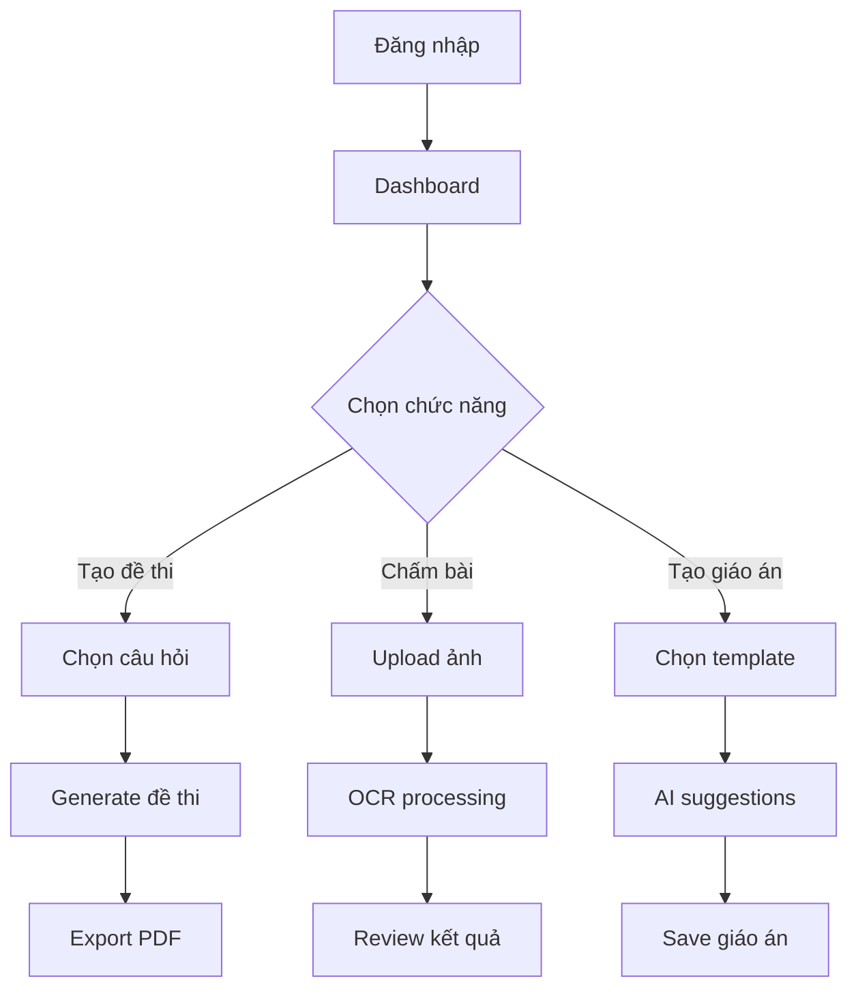
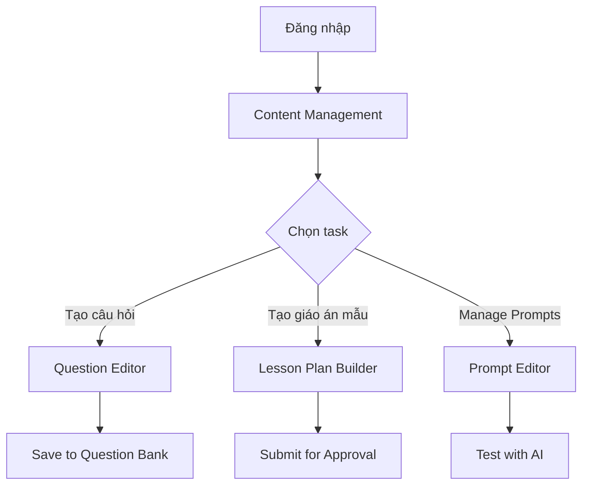

# URD - PlanbookAI

## 1. GIỚI THIỆU

### 1.1 Mục đích tài liệu

Tài liệu này xác định các yêu cầu người dùng cho hệ thống PlanbookAI, một nền tảng web hỗ trợ giáo viên trung học phổ thông trong các hoạt động giảng dạy thông qua công nghệ AI và OCR.

### 1.2 Phạm vi dự án

**PlanbookAI** tập trung giải quyết các vấn đề:

- Giảm thời gian soạn giáo án và tạo đề thi
- Tự động hóa quy trình chấm điểm trắc nghiệm
- Cung cấp không gian lưu trữ tài liệu cá nhân
- Hỗ trợ phân tích kết quả học tập

**Phạm vi ban đầu:** Hỗ trợ giáo viên môn Hóa học (có thể mở rộng sau)

### 1.3 Đối tượng sử dụng

| Vai trò | Mô tả |
|---|----|
| **Admin** | Quản trị viên hệ thống |
| **Manager** | Quản lý nội dung và người dùng |
| **Staff** | Nhân viên hỗ trợ kỹ thuật |
| **Teacher** | Giáo viên sử dụng công cụ AI |

## 2. TỔNG QUAN HỆ THỐNG

### 2.1 Bối cảnh nghiệp vụ

**Vấn đề hiện tại:**

- Giáo viên dành 60-70% thời gian cho công việc hành chính
- Soạn giáo án thủ công tốn thời gian
- Tạo đề thi và chấm bài lặp đi lặp lại
- Khó khăn trong việc theo dõi tiến độ học sinh
- Thiếu công cụ hỗ trợ phân tích kết quả học tập

**Giải pháp đề xuất:**
PlanbookAI cung cấp bộ công cụ AI tích hợp giúp:

- Tự động tạo giáo án dựa trên curriculum
- Sinh đề thi từ ngân hàng câu hỏi
- Chấm điểm tự động bằng OCR
- Phân tích và báo cáo kết quả học tập

### 2.2 Mục tiêu nghiệp vụ

| Mục tiêu | Chỉ số đo lường |
|----|----|
| Giảm thời gian soạn giáo án | Giảm 50% thời gian so với làm thủ công |
| Tăng hiệu quả chấm bài | Chấm được 100 bài trong 10 phút |
| Cải thiện chất lượng đề thi | Đề thi cân bằng theo độ khó |
| Nâng cao trải nghiệm giáo viên | 90% giáo viên hài lòng |

## 3. YÊU CẦU CHỨC NĂNG NGƯỜI DÙNG

### 3.1 Yêu cầu của Admin

#### 3.1.1 Quản lý người dùng

**Là Admin, tôi muốn:**

- Tạo tài khoản cho Manager, Staff, Teacher
- Phân quyền và quản lý vai trò người dùng
- Xem danh sách và trạng thái hoạt động của người dùng
- Khóa/mở khóa tài khoản khi cần thiết

**Tiêu chí chấp nhận:**

- Có thể tạo tài khoản với thông tin đầy đủ
- Phân quyền theo 4 cấp độ: Quản trị viên > Quản lý > Nhân viên > Giáo viên
- Hiển thị nhật ký hoạt động của người dùng
- Gửi email thông báo khi tạo hoặc khóa tài khoản

#### 3.1.2 Cấu hình hệ thống

**Là Admin, tôi muốn:**

- Cấu hình thông số hệ thống (AI parameters, OCR settings)
- Quản lý template giáo án theo chương trình học
- Thiết lập quy tắc phân loại câu hỏi
- Giám sát hiệu năng và tài nguyên hệ thống

**Tiêu chí chấp nhận:**

- Giao diện cấu hình trực quan, dễ sử dụng
- Có thể sao lưu và khôi phục cấu hình
- Ghi nhật ký tất cả thay đổi cấu hình
- Cảnh báo khi tài nguyên hệ thống sắp hết

#### 3.1.3 Theo dõi doanh thu

**Là Admin, tôi muốn:**

- Xem báo cáo doanh thu theo thời gian
- Quản lý các gói subscription
- Theo dõi số lượng người dùng active
- Phân tích xu hướng sử dụng dịch vụ

**Tiêu chí chấp nhận:**

- Bảng điều khiển hiển thị các chỉ số chính
- Xuất báo cáo theo định dạng Excel hoặc PDF
- Biểu đồ trực quan về doanh thu và mức độ sử dụng
- Cảnh báo khi có bất thường về doanh thu

### 3.2 Yêu cầu của Manager

#### 3.2.1 Quản lý gói dịch vụ

**Là Manager, tôi muốn:**

- Tạo và chỉnh sửa các gói subscription
- Thiết lập giá cả và tính năng cho từng gói
- Quản lý promotion và discount codes
- Theo dõi hiệu quả của các gói dịch vụ

**Tiêu chí chấp nhận:**

- Giao diện tạo gói dịch vụ intuitive
- Có thể thiết lập trial period
- Tự động áp dụng discount theo rules
- Báo cáo conversion rate của từng gói

#### 3.2.2 Quản lý đơn hàng

**Là Manager, tôi muốn:**

- Xem danh sách tất cả đơn hàng
- Theo dõi trạng thái thanh toán
- Xử lý các vấn đề về billing
- Gửi thông báo đến khách hàng

**Tiêu chí chấp nhận:**

- Hiển thị đơn hàng theo nhiều tiêu chí lọc
- Tích hợp với payment gateway
- Tự động gửi invoice và receipt
- Hỗ trợ refund và chargeback

#### 3.2.3 Phê duyệt nội dung

**Là Manager, tôi muốn:**

- Review nội dung do Staff tạo ra
- Phê duyệt hoặc từ chối với lý do cụ thể
- Quản lý workflow approval
- Theo dõi chất lượng nội dung

**Tiêu chí chấp nhận:**

- Queue hiển thị nội dung cần review
- Có thể comment và suggest changes
- Notification khi có nội dung mới
- Báo cáo về chất lượng content

### 3.3 Yêu cầu của Staff

#### 3.3.1 Tạo giáo án mẫu

**Là Staff, tôi muốn:**

- Tạo template giáo án theo chương trình chuẩn
- Sử dụng AI để generate nội dung giáo án
- Phân loại giáo án theo môn học và cấp độ
- Cập nhật và maintain giáo án mẫu

**Tiêu chí chấp nhận:**

- Editor hỗ trợ rich text và multimedia
- AI suggestions cho objectives và activities
- Taxonomy system cho classification
- Version control cho giáo án

#### 3.3.2 Xây dựng ngân hàng câu hỏi

**Là Staff, tôi muốn:**

- Tạo câu hỏi trắc nghiệm và tự luận
- Phân loại theo chủ đề, độ khó, cognitive level
- Import câu hỏi từ file Excel/Word
- Kiểm tra chất lượng và duplicate

**Tiêu chí chấp nhận:**

- Question editor với LaTeX support
- Automatic tagging và categorization
- Bulk import với validation
- Duplicate detection algorithm

#### 3.3.3 Quản lý AI Prompts

**Là Staff, tôi muốn:**

- Tạo và chỉnh sửa prompt templates
- Test hiệu quả của prompts với AI
- Phân loại prompts theo use case
- Monitor performance của AI responses

**Tiêu chí chấp nhận:**

- Prompt editor với syntax highlighting
- A/B testing framework cho prompts
- Analytics về AI response quality
- Version control cho prompt templates

### 3.4 Yêu cầu của Teacher

#### 3.4.1 Tạo giáo án cá nhân

**Là Teacher, tôi muốn:**

- Tạo giáo án dựa trên template có sẵn
- Customize nội dung theo class cụ thể
- Sử dụng AI để suggest activities
- Lưu và organize giáo án theo thư mục

**Tiêu chí chấp nhận:**

- Drag-and-drop interface để tạo giáo án
- AI suggestions phù hợp với context
- Personal library để lưu trữ
- Share giáo án với đồng nghiệp

#### 3.4.2 Tạo đề thi và bài tập

**Là Teacher, tôi muốn:**

- Tạo đề thi từ ngân hàng câu hỏi
- Thiết lập độ khó và phân bố câu hỏi
- Generate multiple versions của đề thi
- Preview và export đề thi ra PDF

**Tiêu chí chấp nhận:**

- Filter câu hỏi theo multiple criteria
- Automatic balancing theo Bloom's taxonomy
- Randomization cho anti-cheating
- Professional PDF layout

#### 3.4.3 Chấm bài bằng OCR

**Là Teacher, tôi muốn:**

- Upload ảnh bài làm của học sinh
- Hệ thống tự động nhận dạng tên và đáp án
- Review và correct OCR results
- Xuất kết quả ra Excel/CSV

**Tiêu chí chấp nhận:**

- OCR accuracy > 95% cho printed text
- OCR accuracy > 85% cho handwritten text
- Batch processing cho multiple images
- Manual correction interface

#### 3.4.4 Phân tích kết quả học tập

**Là Teacher, tôi muốn:**

- Xem báo cáo chi tiết về kết quả học sinh
- Phân tích điểm mạnh/yếu theo topic
- Track progress của từng học sinh
- Generate parent reports

**Tiêu chí chấp nhận:**

- Interactive dashboard với charts
- Drill-down analysis capability
- Progress tracking over time
- Automated report generation

## 4. YÊU CẦU PHI CHỨC NĂNG

### 4.1 Hiệu năng hệ thống

- **Thời gian phản hồi:** Dưới 2 giây cho hầu hết các thao tác
- **Xử lý OCR:** Dưới 30 giây cho mỗi tài liệu
- **Người dùng đồng thời:** Hỗ trợ hơn 100 giáo viên cùng lúc
- **Thời gian hoạt động:** 99.5% thời gian khả dụng

### 4.2 Bảo mật thông tin

- **Xác thực:** Xác thực đa yếu tố
- **Phân quyền:** Kiểm soát truy cập theo vai trò
- **Mã hóa dữ liệu:** Khi lưu trữ và truyền tải
- **Quyền riêng tư:** Tuân thủ quy định bảo vệ dữ liệu học sinh

### 4.3 Khả năng sử dụng

- **Giao diện:** Thiết kế responsive cho điện thoại và máy tính bảng
- **Ngôn ngữ:** Hoàn toàn tiếng Việt
- **Khả năng tiếp cận:** Tuân thủ chuẩn WCAG 2.1 AA
- **Thời gian học:** Dưới 2 giờ đào tạo cần thiết

### 4.4 Tích hợp hệ thống

- **Dịch vụ AI:** Tích hợp Gemini AI
- **Công cụ OCR:** Google Vision API
- **Thanh toán:** Tích hợp VNPay, MoMo
- **Xuất dữ liệu:** Định dạng Excel, PDF, Word

## 5. CÂU CHUYỆN NGƯỜI DÙNG

### 5.1 Nhóm chức năng: Quản lý Ngân hàng Câu hỏi

**CH001:** Tạo câu hỏi trắc nghiệm

```
Với vai trò Nhân viên, tôi muốn tạo câu hỏi trắc nghiệm với 4 đáp án
để có thể xây dựng ngân hàng câu hỏi cho giáo viên sử dụng.

Tiêu chí chấp nhận:
- Có thể nhập nội dung câu hỏi với định dạng phong phú
- Tạo 4 lựa chọn với 1 đáp án đúng
- Gán thẻ: môn học, chủ đề, mức độ khó
- Xem trước câu hỏi trước khi lưu
```

**CH002:** Nhập câu hỏi từ Excel

```
Với vai trò Nhân viên, tôi muốn nhập hàng loạt câu hỏi từ file Excel
để tiết kiệm thời gian nhập liệu thủ công.

Tiêu chí chấp nhận:
- Hỗ trợ định dạng Excel với mẫu chuẩn
- Kiểm tra dữ liệu trước khi nhập
- Hiển thị xem trước với báo lỗi nổi bật
- Nhập hàng loạt với thanh tiến trình
```

### 5.2 Nhóm chức năng: Tạo và Chấm Đề Thi

**CH003:** Tạo đề thi tự động

```
Với vai trò Giáo viên, tôi muốn tạo đề thi trắc nghiệm từ ngân hàng câu hỏi
để có đề thi cân bằng về độ khó và nội dung.

Tiêu chí chấp nhận:
- Chọn chủ đề và số lượng câu hỏi
- Tự động cân bằng theo mức độ khó
- Tạo nhiều phiên bản khác nhau
- Xuất ra PDF với định dạng chuẩn
```

**CH004:** Chấm bài bằng OCR

```
Với vai trò Giáo viên, tôi muốn tải lên ảnh bài làm và được hệ thống chấm tự động
để tiết kiệm thời gian chấm bài thủ công.

Tiêu chí chấp nhận:
- Tải lên nhiều ảnh cùng lúc
- OCR nhận dạng tên học sinh và đáp án
- Giao diện sửa lỗi thủ công
- Xuất kết quả ra Excel
```

### 5.3 Nhóm chức năng: Phân tích Kết quả

**CH005:** Bảng điều khiển kết quả học sinh

```
Với vai trò Giáo viên, tôi muốn xem bảng điều khiển tổng quan về kết quả học sinh
để hiểu được tình hình học tập của cả lớp.

Tiêu chí chấp nhận:
- Thống kê tổng quan (điểm trung bình, tỷ lệ đạt)
- Biểu đồ phân bố điểm số
- Phân tích hiệu suất theo chủ đề
- Theo dõi tiến độ từng học sinh
```

## 6. QUY TRÌNH LÀM VIỆC

### 6.1 Quy trình của Giáo viên



### 6.2 Quy trình của Nhân viên



## 7. RÀNG BUỘC VÀ GIẢ ĐỊNH

### 7.1 Ràng buộc kỹ thuật

- Sử dụng .NET Core cho backend
- ReactJS/Next.js cho frontend
- PostgreSQL database (local)
- Deploy trên AWS infrastructure
- Mobile-responsive design

### 7.2 Ràng buộc nghiệp vụ

- Tuân thủ quy định bảo vệ dữ liệu cá nhân
- Hỗ trợ chương trình giáo dục Việt Nam
- Chỉ hỗ trợ tiếng Việt trong phase 1
- Focus vào môn Hóa học ban đầu

### 7.3 Giả định

- Giáo viên có kỹ năng sử dụng máy tính cơ bản
- Internet connection ổn định tại trường học
- AI services (Gemini) hoạt động ổn định
- OCR technology đủ chính xác cho handwriting Việt Nam

## 8. TIÊU CHÍ CHẤP NHẬN HỆ THỐNG

### 8.1 Chấp nhận Chức năng

- ✅ Tất cả câu chuyện người dùng đã được triển khai
- ✅ Kiểm thử đầu cuối đến cuối đã hoàn tất
- ✅ Kiểm thử chấp nhận người dùng đã hoàn tất
- ✅ Yêu cầu hiệu năng đã đáp ứng

### 8.2 Chấp nhận Phi chức năng

- ✅ Kiểm tra bảo mật đã thông qua
- ✅ Kiểm thử tải với hơn 100 người dùng đồng thời
- ✅ Tuân thủ khả năng tiếp cận đã được xác minh
- ✅ Việt hóa hoàn toàn đã hoàn tất

### 8.3 Chấp nhận Nghiệp vụ

- ✅ 90% người dùng hài lòng trong UAT
- ✅ Giảm 50% thời gian lập kế hoạch bài giảng
- ✅ Độ chính xác OCR trên 95% trên bộ dữ liệu thử nghiệm
- ✅ Thời gian hoạt động hệ thống > 99% trong 1 tháng thí điểm
