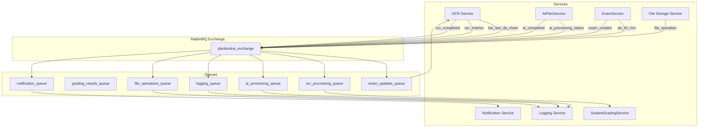

### Kiến trúc dịch vụ (Microservices) – PlanbookAI

- **Mục tiêu**: Chuẩn hóa danh sách dịch vụ, prefix API (tiếng Việt, không dấu), phụ thuộc, và checklist triển khai/đổi tên.
- **Xác thực**: Client → Gateway (JWT proxy) → dịch vụ đích. Gateway xác thực JWT và chèn `X-User-Id`, `X-User-Role`, `X-User-Email`. Downstream services không tự xác thực JWT.
- **RBAC**: ADMIN > MANAGER > STAFF > TEACHER (kiểm tra tại service layer).
- **CSDL**: PostgreSQL với schema: `users`, `assessment`, `content`, `students`.
- **Tổng cộng**: 13 Service

**⚠️ LƯU Ý QUAN TRỌNG**: Ứng dụng hiện tại chỉ hỗ trợ cho **giáo viên Trung học Phổ thông dạy Hóa học**. Tất cả nội dung, mẫu, và logic nghiệp vụ được thiết kế đặc thù cho môn Hóa học THPT.

---

### 1) Gateway
- **Chức năng**: Reverse proxy (YARP), JWT trung tâm, forward `X-User-*`, CORS, rate-limit, health.
- **Prefix**: proxy toàn bộ `/api/v1/*`.
- **Ghi chú**: Dùng `AuthorizationPolicy: "default"` cho route bảo vệ; forward `X-User-Id`, `X-User-Role`, `X-User-Email`.

### 2) Auth Service
- **Chức năng**: Đăng nhập/đăng ký, phát hành/refresh/xác thực token, quản lý vai trò.
- **Prefix**: `/api/v1/xac-thuc`.
- **Bảng (users)**: `users`, `roles`, `sessions`.

### 3) User Service
- **Chức năng**: Quản lý hồ sơ người dùng, thông tin cá nhân, lịch sử hoạt động.
- **Prefix**: `/api/v1/nguoi-dung`, `/api/v1/ho-so-nguoi-dung`, `/api/v1/lich-su-hoat-dong`.
- **Bảng (users)**: `user_profiles`, `activity_logs`.

### 4) ExamService (đổi tên từ TaskService)
- **Chức năng**: Quản lý đề thi end-to-end: tạo → review/chỉnh sửa → lưu đề + đáp án từng câu → xuất bản Word/PDF.
- **Prefix**: `/api/v1/de-thi`, `/api/v1/cau-hoi`.
- **Bảng (assessment)**: `questions`, `question_choices`, `exams`, `exam_questions`.

### 5) PlanService
- **Chức năng**: Tạo giáo án thủ công (trình soạn thảo, mẫu, chủ đề).
- **Prefix**: `/api/v1/giao-an`, `/api/v1/mau-giao-an`, `/api/v1/chu-de`.
- **Bảng (content)**: `lesson_plans`, `lesson_templates`, `chu_de`, (mở rộng) `noi_dung_giao_duc`, `muc_tieu`.

### 6) ClassroomService
- **Chức năng**: Giáo viên quản lý lớp học cá nhân, tổ chức kỳ thi, theo dõi tiến độ, liên kết giáo án.
- **Prefix**: `/api/v1/lop-hoc`, `/api/v1/ca-thi`, `/api/v1/lich-hoc`.
- **Bảng (students)**: `classes`, `class_members`, `class_teachers`, `exam_sessions`, `seating_plans`.
- **Phụ thuộc**: ExamService (đề thi), StudentGradingService (học sinh), PlanService (giáo án).

### 7) OCR Service
- **Chức năng**: Chấm bài từ ảnh/scan (mã đề, đáp án, MSSV), đối chiếu DB, lưu điểm; gắn nhãn "bài lỗi".
- **Prefix**: `/api/v1/ocr`.
- **Phụ thuộc**: ExamService (đáp án), StudentGradingService (học sinh), Auth, lưu trữ file.

### 8) StudentGradingService
- **Chức năng**: Import danh sách học sinh (Excel) → lưu theo giáo viên → review/xác nhận → nguồn điểm.
- **Prefix**: `/api/v1/hoc-sinh`, `/api/v1/lop-hoc`, `/api/v1/ket-qua-hoc-sinh`.
- **Bảng (students)**: `students`, (mở rộng) `classes`, `student_results`.

### 9) AiPlanService
- **Chức năng**: Không gian làm việc với AI (import tài liệu → prompt → AI trả nội dung → review/chỉnh sửa → xuất bản Word/PDF).
- **Prefix**: `/api/v1/ai`.
- **Phụ thuộc**: Gemini AI, lưu trữ file, Auth.

### 10) Logging Service
- **Chức năng**: Monitoring, log tập trung, metrics/tracing, health checks.
- **Prefix**: `/api/v1/monitoring`.

### 11) File Storage Service
- **Chức năng**: Quản lý file tập trung (upload, download, delete, version control), hỗ trợ OCR Service, AiPlanService, PlanService.
- **Prefix**: `/api/v1/file-storage`, `/api/v1/upload`, `/api/v1/download`.
- **Phụ thuộc**: AWS S3 hoặc local storage, Auth.

### 12) Notification Service
- **Chức năng**: Gửi thông báo (email, push notification, in-app) khi OCR hoàn thành, AI xử lý xong, đề thi mới.
- **Prefix**: `/api/v1/thong-bao`, `/api/v1/email`, `/api/v1/push`.
- **Phụ thuộc**: SMTP service, push notification service, Auth.

---

### Chuẩn API & bảo mật
- Đường dẫn: `/api/v1/{ten-dich-vu-khong-dau}`. Tất cả text hiển thị/ lỗi bằng tiếng Việt.
- Downstream đọc header từ Gateway và set `HttpContext.User` qua middleware, không tự parse JWT.
- **Bảo mật dữ liệu giáo viên**: Mỗi giáo viên chỉ thấy dữ liệu của mình, isolation hoàn toàn theo `owner_teacher_id`.

### Cấu trúc Database (tóm tắt)
- `users`: `users`, `roles`, `sessions`, `user_profiles`, `activity_logs`.
- `assessment`: `questions`, `question_choices`, `exams`, `exam_questions`.
- `content`: `lesson_plans`, `lesson_templates`, `chu_de`, `noi_dung_giao_duc`, `muc_tieu`.
- `students`: `students`, `classes`, `student_results`, `answer_sheets`, `class_members`, `class_teachers`, `exam_sessions`.

### Checklist đổi tên TaskService → ExamService
- [ ] Đổi tên project/folder/namespace sang `PlanbookAI.ExamService`.
- [ ] Cập nhật YARP route/cluster ở Gateway cho `/api/v1/de-thi`, `/api/v1/cau-hoi`.
- [ ] Cập nhật Docker image/name, compose service name, healthcheck.
- [ ] Chuẩn hóa entity ↔ bảng `assessment.*` (đồng bộ với script DB hoặc cập nhật script để khớp entity).
- [ ] Cập nhật README và Swagger (tiếng Việt, không dấu).

### Biến môi trường (gợi ý)
- DB: `ConnectionStrings:DefaultConnection` (per service, dùng Search Path đúng schema).
- JWT (Gateway/Auth): `JwtSettings:SecretKey`, `Issuer`, `Audience`, `ExpiryInHours`.
- Lưu trữ file (OCR/AiPlan): `S3_*` hoặc tương đương, cấu hình bằng `.env`.

---

## **Message Queue Architecture**

### **Message Queue System: RabbitMQ + MassTransit**

**Lý do chọn:**
- ✅ Hỗ trợ AMQP protocol, phù hợp với .NET ecosystem
- ✅ Management UI dễ sử dụng và monitor
- ✅ Routing patterns linh hoạt (Direct, Topic, Fanout)
- ✅ Dead letter queues cho error handling
- ✅ Clustering support cho production

### **Services sử dụng Message Queue:**

#### **1) OCR Service (Producer + Consumer)**
- **Producer**: Gửi kết quả chấm bài → StudentGradingService
- **Consumer**: Nhận thông tin đề thi mới từ ExamService
- **Queue**: `ocr_processing_queue`, `exam_updates_queue`

#### **2) StudentGradingService (Consumer)**
- **Consumer**: Nhận kết quả chấm bài từ OCR Service
- **Queue**: `grading_results_queue`

#### **3) AiPlanService (Producer + Consumer)**
- **Producer**: Gửi trạng thái AI processing → Logging Service
- **Consumer**: Nhận yêu cầu AI từ Gateway
- **Queue**: `ai_processing_queue`, `ai_requests_queue`

#### **4) Logging Service (Consumer)**
- **Consumer**: Nhận tất cả events từ các services
- **Queue**: `logging_queue`, `metrics_queue`

#### **5) ExamService (Producer)**
- **Producer**: Gửi thông tin đề thi mới → OCR Service
- **Queue**: `exam_updates_queue`

#### **6) File Storage Service (Producer)**
- **Producer**: Gửi thông tin file upload/download → Logging Service
- **Queue**: `file_operations_queue`

#### **7) Notification Service (Consumer)**
- **Consumer**: Nhận yêu cầu gửi thông báo từ các services
- **Queue**: `notification_queue`

### **Message Flow Patterns:**



### **Message Types & Schemas:**

#### **OCR Processing Messages:**
```json
{
  "messageType": "bai_lam_da_cham",
  "data": {
    "baiLamId": "uuid",
    "deThiId": "uuid", 
    "hocSinhId": "uuid",
    "diem": 8.5,
    "thoiGianCham": "2024-01-15T10:30:00Z",
    "trangThai": "thanh_cong",
    "loiOcr": null
  }
}
```

#### **AI Processing Messages:**
```json
{
  "messageType": "ai_processing_status",
  "data": {
    "requestId": "uuid",
    "loaiYeuCau": "tao_giao_an",
    "giaoVienId": "uuid",
    "thoiGianBatDau": "2024-01-15T10:30:00Z",
    "trangThai": "dang_xu_ly",
    "progress": 45
  }
}
```

#### **Exam Update Messages:**
```json
{
  "messageType": "de_thi_cap_nhat",
  "data": {
    "deThiId": "uuid",
    "maDeThi": "HOA001",
    "soCauHoi": 40,
    "thoiGianLam": 60,
    "thoiGianCapNhat": "2024-01-15T10:30:00Z"
  }
}
```

#### **File Operation Messages:**
```json
{
  "messageType": "file_operation",
  "data": {
    "fileId": "uuid",
    "fileName": "bai_lam_hoc_sinh_001.jpg",
    "operation": "upload",
    "service": "ocr_service",
    "fileSize": 2048576,
    "thoiGianThucHien": "2024-01-15T10:30:00Z",
    "trangThai": "thanh_cong"
  }
}
```

#### **Notification Messages:**
```json
{
  "messageType": "gui_thong_bao",
  "data": {
    "notificationId": "uuid",
    "loaiThongBao": "ocr_completed",
    "nguoiNhanId": "uuid",
    "tieuDe": "Chấm bài hoàn thành",
    "noiDung": "Bài làm của học sinh đã được chấm xong",
    "duongDan": "/ket-qua/bai-lam/123",
    "thoiGianGui": "2024-01-15T10:30:00Z",
    "phuongThuc": ["email", "in_app"]
  }
}
```

### **Docker Configuration:**

```yaml
# docker-compose.yml
rabbitmq:
  image: rabbitmq:3-management
  container_name: planbookai_rabbitmq
  ports:
    - "5672:5672"      # AMQP
    - "15672:15672"    # Management UI
  environment:
    RABBITMQ_DEFAULT_USER: admin
    RABBITMQ_DEFAULT_PASS: planbookai2024
    RABBITMQ_DEFAULT_VHOST: /
  volumes:
    - rabbitmq_data:/var/lib/rabbitmq
    - ./rabbitmq/definitions.json:/etc/rabbitmq/definitions.json
  healthcheck:
    test: ["CMD", "rabbitmq-diagnostics", "ping"]
    interval: 30s
    timeout: 10s
    retries: 3
```

### **NuGet Packages (per service):**

```xml
<!-- Services sử dụng MQ -->
<PackageReference Include="MassTransit" Version="8.1.3" />
<PackageReference Include="MassTransit.RabbitMQ" Version="8.1.3" />
<PackageReference Include="MassTransit.AspNetCore" Version="8.1.3" />
```

### **Service Registration Pattern:**

```csharp
// Program.cs của services sử dụng MQ
builder.Services.AddMassTransit(x =>
{
    x.UsingRabbitMq((context, cfg) =>
    {
        cfg.Host("rabbitmq", "/", h =>
        {
            h.Username("admin");
            h.Password("planbookai2024");
        });
        
        // Configure endpoints based on service
        cfg.ConfigureEndpoints(context);
    });
});
```

### **Error Handling & Dead Letter Queues:**

- **Retry Policy**: 3 lần retry với exponential backoff
- **Dead Letter Queue**: `planbookai_dlq` cho messages thất bại
- **Circuit Breaker**: Tự động ngắt kết nối khi RabbitMQ down
- **Health Checks**: Monitor queue health và connection status

### **Monitoring & Observability:**

- **RabbitMQ Management UI**: Port 15672
- **Queue Metrics**: Message count, throughput, consumer count
- **Error Tracking**: Failed messages, retry attempts
- **Performance Metrics**: Message processing time, queue depth
